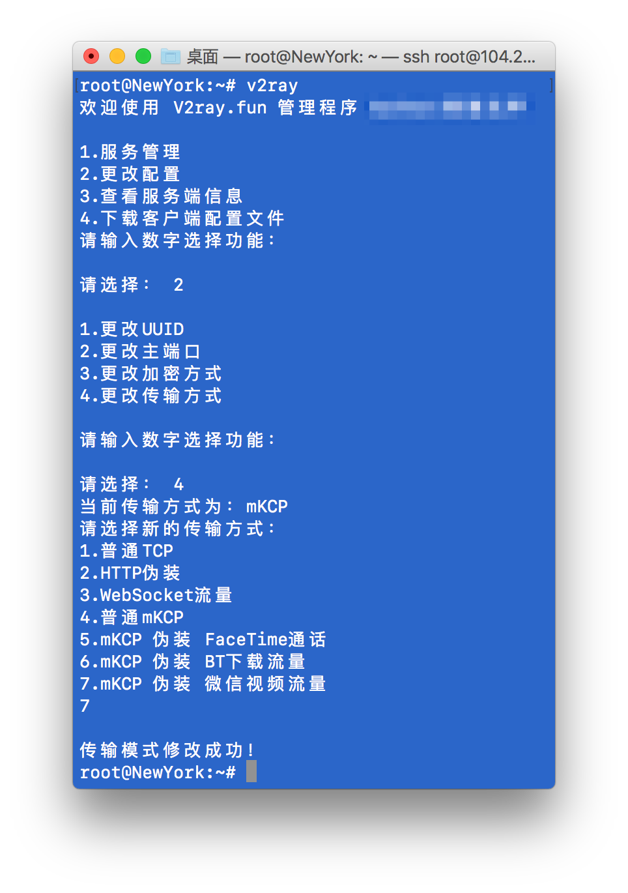

# v2ray.fun
A easily command interaction manager for v2ray
<br>
一个简单的 v2ray 管理工具

## 开发 v2ray.fun 的目的（Purpose of developing v2ray.fun）
Every human has his/her own specialties, they may not skilled enough to familiar with complex configurations about how to config proxy tools and know everything about it, so I wish you can achieve a benifit over this tool and escape variety censorships before access internet safely, conveniently, rapidly, freely.
<br>
<br>
术业有专攻，有些人可能没有足够娴熟的技术，洞察某些代理工具的使用规则，但我希望他们可以借某些工具，从复杂的调参中解脱出来，摆脱某些机构的审查，以安全、便捷、快速、自由地访问互联网。

<!-- vim-markdown-toc GFM -->

## 目录（Catalogs）
* [V2ray.fun](#v2rayfun)
    * [项目简介](#项目简介)
    * [功能](#功能)
    * [客户端](#客户端)
    * [安装命令](#安装命令)
    * [升级命令](#升级命令)
    * [卸载命令](#卸载命令)
    * [截图](#截图)
    * [系统要求](#系统要求)
    * [软件要求](#软件要求)
    * [更新日志](#更新日志)
    * [特别说明](#特别说明)

<!-- vim-markdown-toc -->

## 项目简介

v2ray.fun 是一款用于控制、配置 v2ray Linux 服务端的脚本程序，程序以交互式向导模式，向用户提供更改端口，加密方式，传输协议等功能，可省去手动配置大段 v2ray 配置文件可能出现的格式错误、配置错误等麻烦，尽情享受V2ray的乐趣~~


## 功能

- 一键 启动 / 停止 / 重启 V2ray 服务端
- 自动随机生成 UUID
- 自助修改端口
- 快速查看服务器连接信息
- 一键下载客户端配置文件和**二维码**（通过szrz程序，xshell，secureCRT还有[macOS的iterm2](https://github.com/tracyone/v2ray.fun/wiki/MAC使用RZ、SZ远程上传下载文件都支持)都支持）
- 自由更改**传输配置**：
  - 常规TCP
  - HTTP头部伪装
  - WebSocket流量
  - 常规mKCP流量
  - mKCP 伪装 FaceTime通话流量
  - mKCP 伪装 BT下载流量
  - mKCP 伪装 微信视频通话流量

**WebSocket不包括Nginx分流，请自行安装Nginx来分流。**

## 客户端
- 如需要 v2ray Android/Mac/Windows 客户端，请移步至本项目 https://github.com/leitbogioro/v2ray.fun/releases 页面寻找最新版，iOS 客户端因为 iOS 特殊的应用权限设置，你只能自己想办法去获得（中国区 AppStore 下架了所有跟 v2ray 相关的应用），Linux 版客户端正在开发中。 

## 安装命令

```bash
bash -c "$(curl -fsSL https://git.io/fh9As)"
```

## 升级命令
```bash
bash -c "$(curl -fsSL https://git.io/fh9AZ)"
```

## 卸载命令
```bash
bash -c "$(curl -fsSL https://git.io/fh9AC)"
```


## 截图




<div align=center></div>

## 系统要求（以下默认均为 x64 版，x86 版因 nodejs 等组件无法安装，故不提供支持！）
## OS Requiremets(These following OS are default x64 version, x86 versions are not supported and don't install on them!)

- Debian 7 
- Debian 8
- **Debian 9（推荐 Recommended）**
- Ubuntu 14 
- **Ubuntu 16（推荐 Recommended）**
- Ubuntu 18
- CentOS 6（独家 This is the unique version can be installed on this OS despite v2ray official don't support CentOS6）
- CentOS 7

## 软件要求

请使用**Xshell**连接服务器，以获得完美的中文支持以及配置文件下载功能。

## 更新日志

- 第一版通过测试发布（2017.9.4）。

- 新增TLS功能，自动获取证书（2017.10.16）。

- 支持修改alterID（2018.5.1）。

- 支持动态端口的使能和禁止（2018.5.1）。

- 支持修改动态端口的范围（2018.6.11）

- 增加菜单：更新 v2ray 以及 v2ray.fun（2018.6.11）

- 支持生成v2rayN(windows以及安卓) & Pepi(IOS) 客户端的 vmess 链接和 qrcode 图片，支持通过用 sz 将配置详情的二维码图片下载到本地。（2018.7.7）

- 由 tracyone 维护的 v2ray.fun 项目已被删除，本人稍作修改暂可继续使用。（2019.2.7）
<b>Attention!</b>
如果您安装了之前由tracyone编写的项目，请不要贸然使用全新安装的方式升级，否则会使您当前安装的v2ray配置文件被重设以至于无法正常工作！

- 修改广告过滤功能实现的方式，将v2ray所依赖的 config.json 配置文件中冗长的域名列表去除，采用外挂[ToutyRater](https://github.com/ToutyRater) 制作的 h2y.dat 文件中的广告过滤规则，不但减轻了操作 config.json 文件的压力，还让广告过滤列表可以随时方便地更新。[项目地址](https://github.com/ToutyRater/V2Ray-SiteDAT)。（2019.2.17）

- 经测试，动态多端口功能并不能有效提高对 GFW 的欺骗，故将该功能设置为默认关闭的状态。（2019.2.17）

- 修复了一处在主程序启动时更新 v2ray 会导致配置文件被贸然删除的错误。（2019.2.19）

- 如果检查到运行环境中存在阿里云服务，安装将立即终止。（2019.3.3）

- 新增替换原来的广告过滤策略并采用新的广告过滤策略。（2019.3.4）

- 为老用户（有旧配置文件的）提供删除原配置文件中冗长的广告过滤配置文件并采用新的广告过滤策略功能，做到平滑过渡。（2019.3.4）

- 独家为 CentOS 6 系统提供兼容性支持（v2ray官方版暂不支持在 CentOS 6 上运行）。（2019.3.17）

- 由于操作失误，本项目被误删，经过一天的抢救，现已恢复。（2019.3.20）

- 新增自动更新广告过滤策略的能力。（2019.3.23）

- 如果服务端采用了 ws（websocket）协议，并正在监听 localhost （127.0.0.1），配合 v2ray.fun 服务端的端口设置，可视为该服务端正对本地（特指服务端的本地）的某个端口进行监听，并和 Nginx/Caddy/Apache 等 Web 服务器在本地建立起连接的行为，然后由 Web 服务器对该本地的通信通道做一次转发，将其映射到公网外部，以便外部的 Client （客户端）能够直接以 websocket 协议，在该服务器 443 端口上发起 https 连接，经过该 Web 服务器的反向转发（相对于服务端本地的向外转发），得以与隐藏在该 Web 服务器的 https 网站的某个目录下（可选设置）的 v2ray 服务端建立通信。故对应显示的客户端 url 配置中的端口，应当是 443，且默认开启 tls。

- 修改安装时生成随机端口的策略。（2019.3.23）

- 安装完成后，为 /usr/local/v2ray.fun 文件夹中的主要程序文件增加权限。（2019.3.23）

- 修复了因判断逻辑错误，CentOS 无法正确安装的问题。（2019.4.10）

- 添加自动维护功能，该功能包含：每周自动重启 v2ray 服务、更新广告过滤规则、清理访问日志。（2019.7.31）

- 由于选用ws模式时，程序自动在配置文件的inbound>streamsettings>listen中写入本地地址，调回tcp模式的时候，这个值没有被写回来，所以我在写入json模块中“调整为tcp传输模式”选项里，加入一条将inbound中的listen参数强制拨回为null的指令，问题已修复。（2019.8.16）

- 升级 PC 客户端、Android 客户端版本。（2019.8.24）

- 升级 PC 客户端版本，由于该客户端依赖 Net_Framework_4.7.2，故提供该组件的离线安装包下载程序。（2019.9.20）

## 特别说明 && 致谢

也可以先查看下本仓库的[wiki](https://github.com/leitbogioro/v2ray.fun/wiki)

本程序遵循 GPL v3协议发布，如想 Fork/修改，烦请把以下跟此项目有关的变迁和来源，贴到您项目的 README.md 中，谢谢！

V2ray : [https://v2ray.com](https://v2ray.com)

一代目（已转型，正开发全新的v2ray.fun项目: https://github.com/FunctionClub/V2ray.Fun）: [雨落无声](https://github.com/YLWS-4617)

二代目（已引退）: [tracyone](https://github.com/tracyone)

三代目（在服役）: [leitbogioro](https://github.com/leitbogioro)

本项目从 [wpyok500](https://github.com/wpyok500) 备份的 [https://github.com/wpyok500/v2ray.fun-1](https://github.com/wpyok500/v2ray.fun-1) 项目 fork 而来，如有问题，欢迎随时提交 issues 反馈
